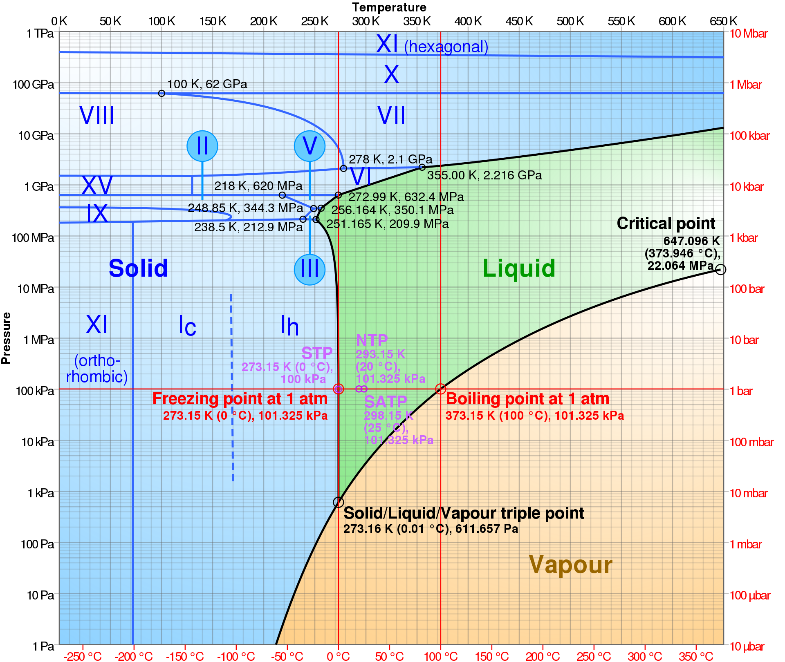

# 1) Properties of Snow

Each week, the labs are designed to give you specific coding examples to help you with that week's homework.
Please look through the background and lab material before beginning the homework.  Note that the first week's lab has a lot of examples to help people learning python.  This will get easier as we go.

# Background

"So mom, liquid water is just water, and solid water is ice, so what is snow?  I can walk on it, so it's solid, but it's not the same as ice."

Very few substances exist in all three phases in nature.  We experience water vapor, water, and ice so frequently that we forget how unique they are.

 

To understand how water changes phase within the atmosphere and within a snowpack, we need to understand basic chemistry and molecular physics. 
[Popular Science video with ads on growing snowflakes with Ken Libbrecht](https://www.youtube.com/watch?v=ao2Jfm35XeE) 

We may not have a lab of this quality, but you can print and build your own hexogonal snow crystal out of [paper](data/CutOutIceCrystalPrism_Aug25.jpg).  

---

```note
## Lab 1: Plotting Data and Calculating the Energy of Phase Changes in Python

Download the lab and data files to your computer. Then, upload them to your JupyterHub [following the instructions here](../resources/b-learning-jupyter.html#jupyterhub). Note, if you took CEWA 565 Data Analysis Class or are otherwise already familiar with Python, you can skip Lab 1-1 and go to Lab 1-2.

* Download this data file for the lab activities: [Skykomish peak flows](data/Skykomish_peak_flow_12134500_skykomish_river_near_gold_bar.xlsx)
* [Lab 1-1: Plotting Data in Python](lab1/lab1-1.ipynb)
* [Lab 1-2: Phase Changes](lab1/lab1-2.ipynb)

Some extra helpful activities:
* [Numpy Tutorial](lab1/numpy-tutorial.ipynb)
* [Some more python tips](lab1/some-python-tips.ipynb)
```

---

## Homework 1

### Problem 1: Water and States of Matter

For this week's homework, we will pretend we are in very controlled laboratory conditions.  If you dislike python, these questions can all be answered with pencil, paper, and a calculator, but you may want to use this exercise as a chance to practice your programming skills.

 A. Imagine you have a 1 cubic centimeter block of ice at -10 degrees C and 1 atm of pressure.  Calculate the amount of energy required to **melt** all of the ice.  (Note that you will have to warm it to 0 degrees C before you begin melting it.)

 B. Now, consider that same block of ice at -10 degrees C and 1 atm of pressure.  Calculate the amount of energy required to **sublimate** all of the ice.  (Note that you do not need to warm the ice to sublimate it.)
  
 C. We know that cold snow is primarily a mixture of ice and air.  Consider no phase changes and temperatures between -15 degrees and -5 degrees C.  Imagine that no interactions occur between the ice and air in the snow matrix.  How does the energy required to heat the mixture those 10 degrees change as the fractions of ice vs. air change in the total mixture?  
 
 D. I argue that sublimation saves the snowpack more than it reduces it.  Why would I say this?  Do you agree or disagree?  Use the specific and latent heats in lab 1-2 to make your argument.

### Problem 2: 
On your reading of Librrecht 2007 “The formation of snow crystals”.

Explain, in your own words, but Librrecht means by "knife-edge instability". Maximum 5 sentences. 

---
