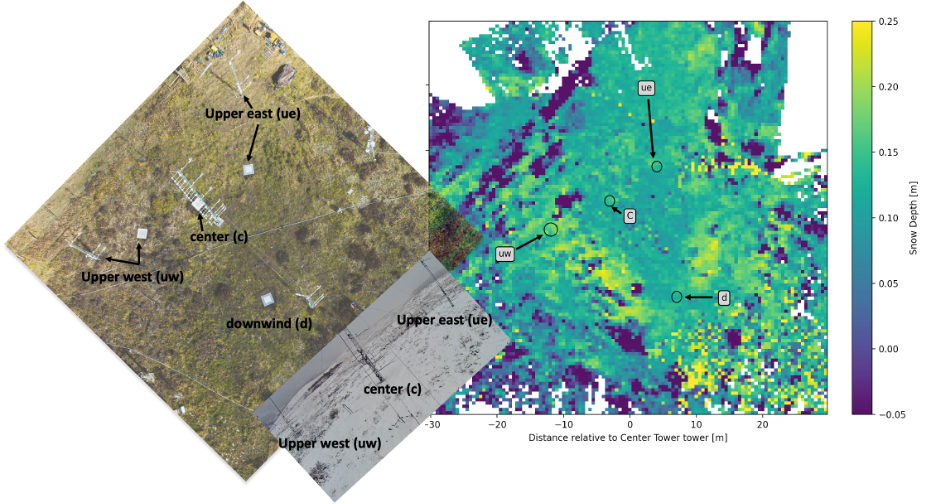

# 2) Mass Balance:  How much snow is there?

# Background

For many regions, mountain snow provides much of society's water.  The weight of snow is due almost entirely to its water content.  Therefore, one of the main instruments of snow hydrology is a giant scale similar to the one you might find in your bathroom.  In the video below, we are installing a fluidless snow pillow in the East River Basin at Kettle Ponds.  Many snow pillows are filled with fluid and measure the pressure on the fluid from the weight of the snow.  In the Western U.S., networks of snow pillows are maintained by the [National Resource Conservations Service,NRCS](https://www.nrcs.usda.gov/wps/portal/wcc/home/quicklinks/imap) and the [California Department of Water Resources](https://cdec.water.ca.gov/snow/).

[](https://www.youtube.com/watch?v=6Ivn666w5xo)


```note
## Lab 2: Mass Balance

This week's lab includes two options -- if you are interested in accessing further data on you own, work through the long version of the two labs to learn how to access data from servers and import it to your computer.  Downloading a lot of data can take some time, so be patient.  If you are short on time or new to python and want to learn first how to plot basic data, work through the short versions of the labs.

Download the lab and data files to your computer. Then, upload them to your JupyterHub [following the instructions here](/resources/b-learning-jupyter.html#working-with-files-on-our-jupyterhub).

* Data (needed for both versions): [Daily Precipitation at Kettle Ponds](data/precipitation.nc) and [Map of area](data/east_polygon.json) 

* [Lab 2-1 (long version): Downloading and plotting data from a Snotel station](lab2/lab2-1.ipynb)
* [Lab 2-2 (long version): Downloading and plotting data from the Kettle Ponds snow pillows and one temperature sensor](lab2/lab2-2.ipynb)

* Data (needed for the short version): [Snow Pillow data at Kettle Ponds](data/sos_SWE_T_P.nc)

* [Lab 2-1 (short version): Downloading and plotting data from a Snotel station](lab2/lab2-1-short.ipynb)
* [Lab 2-2 (short version): Plotting data from the Kettle Ponds snow pillows and one temperature sensor](lab2/lab2-2-short.ipynb)

```


Above, we see an aerial photo, with each tower and corresponding snow pillow labeled.  We also see a lidar map of snow depth, with the snow pillow locations shown with circles, and a webcam photo taken from the downwind tower towards the central and upwind towers.


## Homework 2

### Problem 1

Using the observations of total precipitation and the snow pillow data (see labs above), we are going to investigate the mass balance and snow accumulation at Kettle Ponds.

A. Plot a timeseries of total accumulated precipitation and total accumulated snow water equivalent from the four snow pillows.  Add to your plot timeseries from the two Snotel Stations located nearby.  Discuss how they match and how they differ, and why you think they differ.

B. Write out the snow mass balance equation for a control volume.  Given the data you have plotted, what aspects of the mass balance equation do you have the most certainty about?  The least certainty?

C. What factors of the mass balance are the most similar spatially?  Which differ the most across different locations?  Is there more variability between sites further away?  Or are the four snow pillows at Kettle Ponds as different as the two sites just outside of the watershed?

D. **Prediction** NCAR's EOL team is committed to removing the towers at Kettle Ponds on 1 June 2023.  To do that, they need to drive down a road (shown in the map above) that is currently snowed in.  The road will open when the snow melts and disappears. This typically occurs in mid to late May.  Using the long term records at the SNOTEL sites, and any other information you may have, to make a prediction about whether the snow will be gone (and hence the road clear) by 1 June 2023. (Note that we will assess everyone's accuracy at the end of the quarter!)


### Problem 2: Course Project Selection

Write a brief paragraph (3-9 sentences) describing your term project. If you would like to work with a partner, include the name of your partner, or specify you will be doing the project alone.  Describe the concept you will communicate or teach, and the tools you will use. **If you have questions about the project, now is the time to talk to the instructor.**
