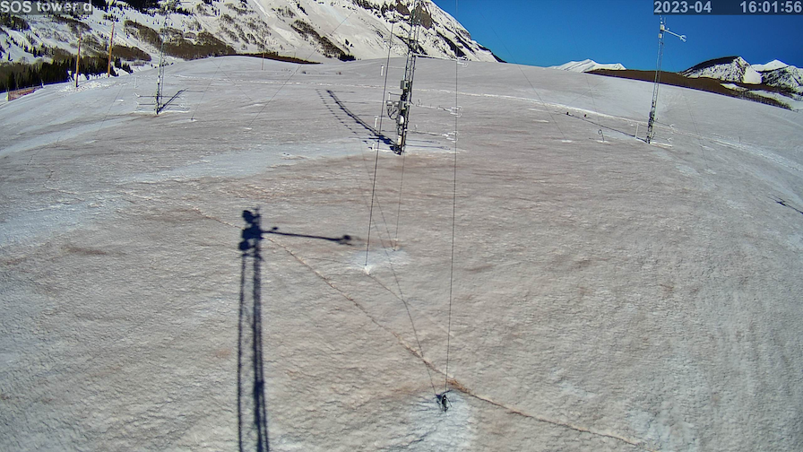
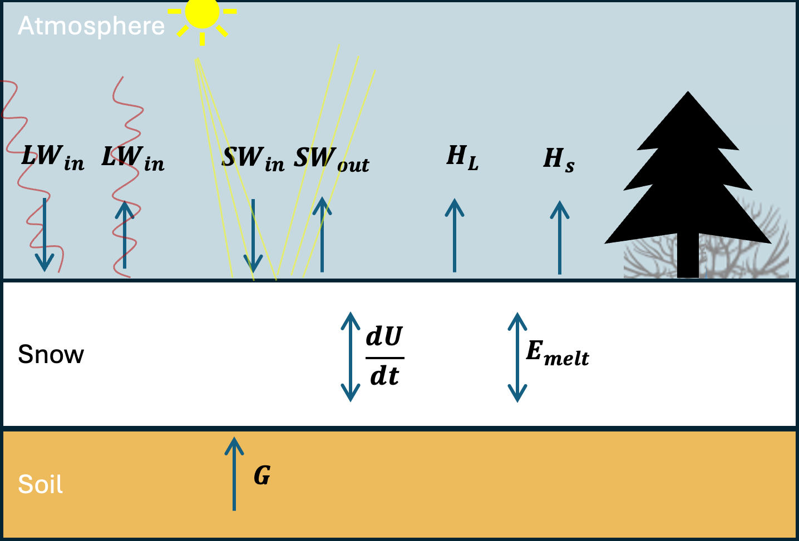
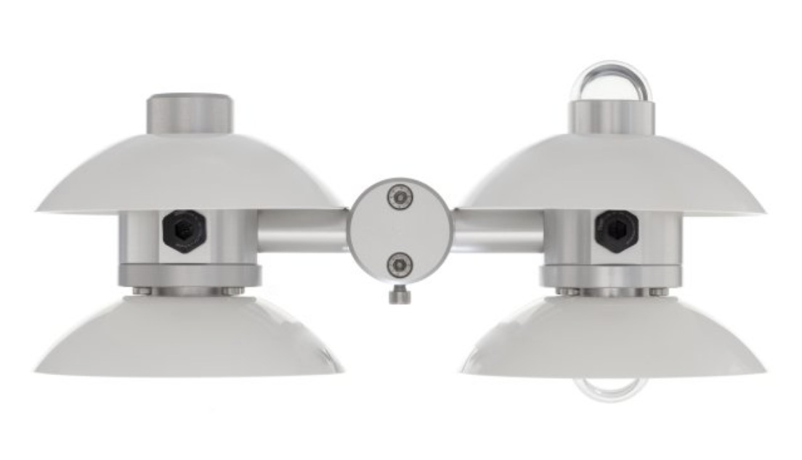
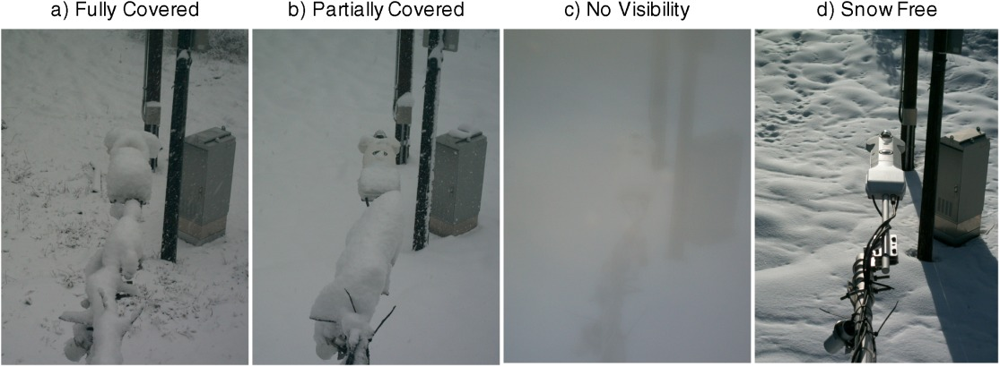

# 3) Snowpack Energy Balance – Radiation + Albedo, Dust on Snow

## Energy Balance Equation


The balance of energy over a snow surface is a phenomenon studied by both biologists, hydrologists, boundary layer meteorologists, and snow scientists. Many fields use the surface energy balance (SEB) to estimate evaporation and transpiration of water from the earth's surface. Meteorologists study the SEB's radiative effects on the atmosphere.

Because we are interested in the snowpack, we modify the more common "surface energy 
balance" and consider a "snowpack energy balance".
The snowpack energy balance states that the change of the internal energy of the snowpack is a result of incoming and outgoing sources of energy,

$$∆ \text{Internal Energy} = \text{Incoming Energy} - \text{Outgoing Energy} $$

Energy fluxes are on both sides of the equation are measured in units of Watts per meters squared (W/m^2). The full snowpack energy balance is written 

$$\frac{dU}{dt} = LW_{in} + LW_{out} + SW_{in} + SW_{out} - H_L - H_s + E_{melt} + G$$



where $U$ is the internal energy of the snow pack, the first and second terms on the right represent incoming and outgoing longwave radiation (AKA infrared radiation). 
The third and fourth terms represent incoming and outgoing shortwave radiation (ultraviolet, visible, and near-infrared radiation).
The fifth term is the vertical flux of latent heat _away_ from the snowpack surface, i.e. the flux of water vapor away from the snowpack, either through sublimation or perhaps evaporation from melted water at the snowpack surface. 
The term is positive during sublimation when energy is lost from the snowpack.
Occasionally, deposition occurs (i.e. the solid equivalent of condensation, also known as surface hoar formation), and the term is negative, and energy is gained by the snowpack.
The fifth term is the vertical flux of sensible heat _away_ from the snowpack surface. Generally, but not always, the air over a snowpack is warmer than the snowpack surface temperature, and so H<sub>s</sub> is negative and energy is gained by the snowpack from sensible heat flux. It can sometimes become positive, if the snow surface becomes warmer than the air above it. Note that positive sensible heat flux is the normal condition over a bare earth surface during mid day (the earth's surface is warmer than the air above).
The sixth term is the energy that is lost to the latent heat involved in the melting of snow.
The seventh term is the energy transmitted from the earth upwards into the bottom of the snowpack. 
Because snow is such a good insulator (air is a good insulator, and snow has lots of air - think about a down coat), the bottom of the snowpack is often 0˚C. In this state, a very small amount of water at the bottom of the snowpack persists throughout the snow season. In this case, $G = 0$ because there is no temperature gradient across the soil-snow interface. 

Note that internal energy ($U$) of the snowpack is a function of the temperature, density, and specific heat capacity of the snowpack. Mass has internal energy, so generally one would consider a _volume_ of snow to have internal energy, but in our case, we are interested in energy fluxes, and so we use the depth of the snowpack. This is best explained by doing some dimensional analysis. The internal energy of snow, per kilogram, is approximately

$$ U =c_p^{ice} \langle \rho_s T_s \rangle $$

where the angle brackets indicate depth-averaging of the snow temperature and snow density. This equation has units

$$U = [kg m^{-3}] [J K^{-1} kg^{-1}] [K] = J m^{-3} $$

We want the units to be J m^-2, so we simply multiply by the depth of the snowpack (∆z), and take the derivative with respect to time

$$\frac{d}{dt} (U \Delta z) = \frac{d}{dt} \big( c_p^{ice} \Delta z \langle \rho_s  T_s \rangle \big)$$

which is in units of W m^-2 as desired (remember, 1 Watt = 1 Joule / second).
Generally, we assume that snow density and depth are changing slowly, at least more slowly than the snowpack temperature, and thus we could pull those terms out of the time derivative to get

$$ c_p^{ice} \Delta z \langle \rho_s \rangle \frac{d}{dt} \langle T_s \rangle = LW_{in} + LW_{out} + SW_{in} + SW_{out} - H_L - H_s + E_{melt} + G$$

Note that the equation above implies that to accurately measure the internal energy of snow, we need measurements of temperature and density throughout the depth of the snow. 
Also, if it turns out that snow density and snow depth do NOT change slowly, we need to include those terms within the time derivative, which complicates things. 

Snow scientists are generally most interested in snow melt ($E_{melt}$) and snow sublimation ($H_L$) and the majority of the energy available for snow melt or sublimation comes from the net radiation, the sum of the four radiation terms.

## Radiation Terms 
Incoming shortwave radiation ($SW_{in}$) comes from the sun and is a function of time of year, time of day, cloud cover, atmospheric aerosols, and topographic position. We can predict/model SW radiation well, although in complex/mountainous terrain, topography matters a lot.

Gasses in the atmosphere ("greenhouse gasses"), mostly water vapor, absorb shortwave radiation and heat up, such that $SW_{in}$ at the earth's surface is always lower than at the outermost edge of the atmosphere. 
Snow is highly reflective, returning 60-90% of the incoming SW radiation to the atmosphere, i.e. snow has a high [*albedo* ($\alpha$)](https://mynasadata.larc.nasa.gov/mini-lessonactivity/what-albedo). 
Albedo, $\alpha$, varies between zero and 1; a highly reflective surface reflects most of the incoming solar radiation ($\alpha$ approaches 1) and non-reflective surfaces absorb most of the incoming solar radiation ($\alpha$ approaches 1). Snow albedo varies between 0.6 and 0.9. although dirt, dust, and rocks on snow or glacier surfaces can decrease the surface-averaged albedo significantly. 

Longwave radiation is output by all mass in the universe, and the output LW radiation is proportional to the surface temperature of the mass, according to the [Stefan–Boltzmann Law](https://en.wikipedia.org/wiki/Stefan–Boltzmann_law), which states that energy radiated per unit surface area per unit time (i.e. energy flux at the surface) is equal to the fourth power of the black body's (surface's) temperature, and therefore the outgoing longwave radiation (i.e. the energy emitted by the earth into the atmosphere) is defined

$$LW_{out} = \epsilon \sigma T^4$$

where $\epsilon$ is the Stefan–Boltzmann constant ($\sigma \approx 5.67 × 10^{−8} \space W⋅m^{-2}⋅K^{-4}$)
and $\epsilon$ is the emisivity of the surface emitting the radiation ($\epsilon$ varies between zero and one). The snowpack surface [emissivity](https://www.jpl.nasa.gov/images/pia18833-nasa-spacecraft-maps-earths-global-emissivity) is near 1, meaning that the snowpack surface (i.e. water molecules) absorb most of the incoming LW radiation, and reflect very little. $\epsilon$ for the snowpack depends on snowpack properties, but a commonly assumed value is $\epsilon = 0.985$.
Note that the Stefan-Boltzmann law implies that when gases in the atmosphere (i.e. clouds) absorb incoming shortwave/solar radiation and warm up, they increase their output of longwave radiation.
This means that the presense of clouds both decrease incoming solar radiation at the snow surface and increase incoming longwave radiation at the snow surface.

The reflective properties of the snow surface mean that the shortwave terms in the energy balance equation can be rewritten,

$$SW_{in} + SW_{out} = (1 - \alpha) SW_{in}$$

The Stefan-Boltzmann law implies that the longwave terms could be rewritten 

$$LW_{in} + LW_{out} = LW_{in} - \epsilon \sigma T_{ss}^4$$

where T<sub>ss</sub> is the temperature of the snow surface (in Kelvin).

These equations will be useful in completing the labs and homeworks in this module. 

```note
## Lab 3: Plotting radiation and energy balance data at Kettle Ponds.

* [Lab 3-1](lab3/lab3-1.ipynb)
* [Lab 3-2](lab3/lab3-2.ipynb)
* [SoS dataset](data/sos_full_dataset_30min.nc)
```

## Homework 3
Radiometers are used to measure the radiation components of the surface energy balance.
One type of instrument, a "net radiometer" or "four-stream radiometer", measures incoming and outgoing longwave and shortwave radiation using four sensors built into a single instrument. An image of a type of radiometer used by the Sublimation of Snow Campaign, the [Hukseflux NR01](https://www.hukseflux.com/products/pyranometers-solar-radiation-sensors/net-radiometers/nr01-net-radiometer), is shown below.

[](data/huskeflux_nr01.png)

### Problem 1: Comparing solar radiation sensors
A common problem in snow energy balance studies is that snow accumulates on the upward pointing radiometers (see image below, compliments of [Lapo et al., 2015](https://doi.org/10.1002/2015WR017590)).

[](data/radiometer_snow_covered_lapoetal_2015.jpg)

Use the precipitation dataset from Lab 2 to examine both incoming and outgoing radiation measurements during and after times with precipitation.
Find a time in the dataset when you think snow covered the radiometer and explain why this occurred.

You may find that skimming the following paper is useful, but it's not necessary. [Lapo et al., 2015](https://doi.org/10.1002/2015WR017590) Karl Lapo is a graduated, former UW PhD student.

### Problem 2: Clouds
Identify two periods of variable cloud cover in the dataset, one during nighttime and one during daytime.
You can use shortwave radiation measurements to identify what is day/night.
Explain why and how you can use both shortwave and longwave measurements to identify variations in cloud cover.
Explain what both shortwave and longwave radiation tell you about the cloud cover.

### Problem 3: Estimating snow surface temperature from outgoing longwave radiation
At Kettle Ponds, a dedicated instrument for measuring surface temperature (an Apogee infrared radiometer) is used to measure surface temperature (see variables `Tsurf_c`, `Tsurf_d`, `Tsurf_ue`, `Tsurf_uw`).
One could also estimate surface temperature using the broadband longwave radiometers (which measure more than just infrared wavelengths, see variable  `Rlw_out_9m_d`). 
Use broadband longwave radiometer meausrements of outgoing longwave radiation (`Rlw_out_9m_d`) to estimate snow surface temperature using the Stefan-Boltzmann equation. For 3-7 days during any time in the dataset, plot your estimate of surface temperature along with the Apogee infrared radiometer estimate. 
Discuss how they differ and why they might differ.

### Problem 4: Dust on snow and albedo
The reflectivity of snow, AKA albedo ($\alpha$), is defined

$$\alpha = \frac{SW_{out}}{SW_{in}}$$

It is understood intuitively to most people in cold climates that snow is brightest right after new snowfall, and darkens as it ages.
This is a result both of the rounding and growing of snow grains as well as the "dirtying" of snow through the deposition of atmospheric deposition particulates.
In April, 2024, a substantial amount of dust was deposited on our site at Kettle Ponds (see the photo at the top of this page).
Calculate and plot albedo during April the first half of April and identify the date on which you think dust was deposited. Explain how you come to this conclusion.

### Problem 5: Snow surface energy balance - Intuition

In Lab3-2, we plotted the average diurnal cycle of the snow surface energy balance (the final plot in that lab). Explain what you observe in this plot (you do not need to recreate the plot in your homework). What do each of the five terms represent? When is each term negative/positive and why?

### Problem 6
On your reading of Warren 2019.

Explain why coarse-grained snow has lower albedo than-grained snow. 
