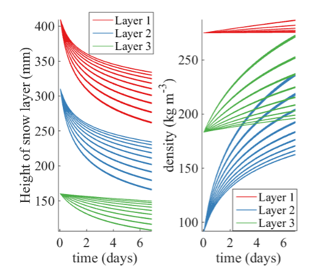

# 3) How does a snowpack change?

## Background

Snow exists on earth very close to its melting point.  This means it has a very high [homologous temperature](https://en.wikipedia.org/wiki/Homologous_temperature) and is naturally subject to [sintering](https://en.wikipedia.org/wiki/Sintering), creep and deformation similar to metals heated in a forge. 

**To study how snow changes with time, we can bring it into a cold lab, or we can dig snow pits and study the layers.**

# About Snow Pits
Kelly Elder put together a good set of training videos for the NASA SnowEx Campaigns.  You can view these via the links below.
* [An Introduction to NASA SnowEx Snow Pit Sampling Methods](https://www.youtube.com/embed/PCteYh66dEQ)
* [SnowEx Snow Pit Profile Sampling](https://www.youtube.com/embed/DEJvh5dZnpY)
* [SnowEx Snow Pit Density Sampling](https://www.youtube.com/embed/VtHj3ccu5A8)

# About Snow Metamorphism
[SLF Website on Snow Metamorphism](https://www.slf.ch/en/snow/snow-as-a-material/snow-metamorphism.html)
In [A Field Guide to Snow](https://www.amazon.com/Field-Guide-Snow-Snowy-Owl/dp/1602234140/), read Chapter 4 on how to dig and interpret data from a snow pit, and read Chapter 5 on snow metamorphism.
To hear Matthew Sturm explain the concepts in these chapters, check out his [class lecture on snow metamorphism](https://www.youtube.com/watch?v=tg2v1DC5Nrk&list=PLPG5Ed5L1SY4RpFe-55WAlFZ58-TwwrWw&index=5).

# About Snow Compaction and Snow Density


One way that snow changes through time is simply from compacting under the weight of the snow above it.  This will cause depth to decrease and density to increase. The image above is from supplemental material from [Nic Wayand's 2013 paper](data/Wayand_rain_snow_newdensity_hyp11002.pdf).  We can see in observations (labs below) that the depth of snow will often decrease even during periods when the snow water content does not change.  You can read about how people have conceptually modeled snow compaction in Section 4.1 of [Richard Essery's 2013 paper on snow modeling](https://www.sciencedirect.com/science/article/pii/S0309170812002011).

```note
## Lab 3: How does a snowpack change?

For our lab, we are going to look at one of the easier-to-observe processes of a changing snowpack:  compaction.  To do this, we will use the Kettle Ponds snow pillow data from Lab 2 and combine it with lidar-derived snow depth data at the same locations.  (For a map of where the snow pillows are in relation to each other, see the backgroun section of Module 2.  For a link to a video explaining how the lidar instruments work, see the background section on Module 4.)

Download the lab and data files to your computer. Then, upload them to your JupyterHub [following the instructions here](/resources/b-learning-jupyter.html#working-with-files-on-our-jupyterhub).

* [Lab 3-1: Plotting Snow Depth from scanning lidar](lab3/lab3-1.ipynb)
* [Lab 3-2: Calculating Snow Density and investigating compaction](lab3/lab3-2.ipynb)

* [Lidar 1 Snow Pillow Depths](data/lidar_l1_pillow_depths.nc)
* [Lidar 2 Snow Pillow Depths](data/lidar_l2_pillow_depths.nc)
* [Lidar 3 Snow Pillow Depths](data/lidar_l3_pillow_depths.nc)
* [Lidar 4 Snow Pillow Depths](data/lidar_l4_pillow_depths.nc)
* [Lidar 5 Snow Pillow Depths](data/lidar_l5_pillow_depths.nc)
* [Lidar 6 Snow Pillow Depths](data/lidar_l6_pillow_depths.nc)


```

## Homework 3: 
(Note:  We will be using the lab material above in Homework 4; for this week's homework, we are focusing on 3-D printing snow and explaining what we see.)

### Problem 1
For this week's homework, use the MakerSpace to create a 3-D printer version of snow.  Explain the characteristics of your snow cube and what physical processes led it to be that way.

Extra Credit:  Give your snow cube to someone and use it to teach them about snow and the evolution of the snowpack.  Report back on what that person thought and how we might explain this better in the future.

