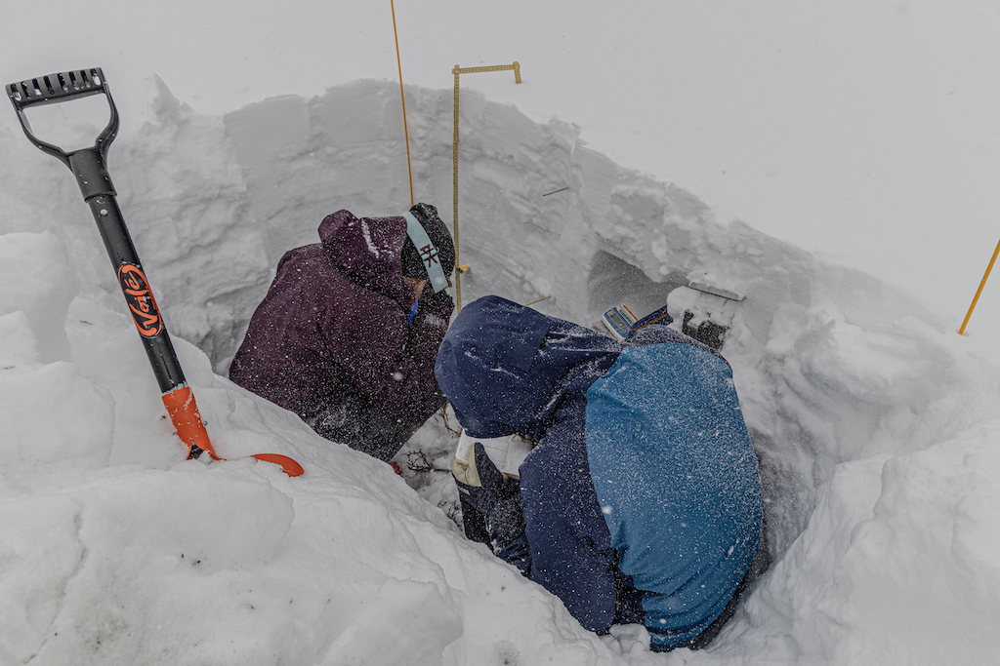
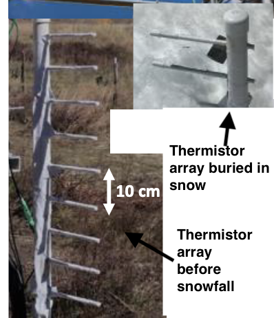

# 4) Temperatures: snowpack and atmospheric stability 

## Temperatures in the snowpack - expanding the snowpack energy balance equation

From Module 3, we know the snow energy balance can be written

$$\frac{d}{dt} (U \Delta z) = LW_{in} + LW_{out} + SW_{in} + SW_{out} - H_L - H_s + E_{melt} + G$$

where $U$ is the internal energy of the snow pack and ∆z is the snowpack depth. See Module 3 for a description of the other terms.  The internal energy ($U$) of the snowpack is a function of the temperature, density, and specific heat capacity of the snowpack. Mass has internal energy, so generally one would consider a _volume_ of snow to have internal energy, but in our case, we are interested in energy fluxes, and so we use the depth of the snowpack. This is best explained by doing some dimensional analysis. The internal energy of snow, per kilogram, is approximately

$$ U =c_p^{ice} \langle \rho_s T_s \rangle $$

where the angle brackets indicate depth-averaging of the snow temperature and snow density. This equation has units

$$U = [kg m^{-3}] [J K^{-1} kg^{-1}] [K] = J m^{-3} $$

We want the units to be J m^-2, so we simply multiply by the depth of the snowpack (∆z), and take the derivative with respect to time

$$\frac{d}{dt} (U \Delta z) = \frac{d}{dt} \big( c_p^{ice} \Delta z \langle \rho_s  T_s \rangle \big)$$

which is in units of W m^-2 as desired (remember, 1 Watt = 1 Joule / second).
Generally, we assume that snow density and depth are changing slowly, at least more slowly than the snowpack temperature, and thus we could pull those terms out of the time derivative to get

$$ c_p^{ice} \Delta z \langle \rho_s \rangle \frac{d}{dt} \langle T_s \rangle = LW_{in} + LW_{out} + SW_{in} + SW_{out} - H_L - H_s + E_{melt} + G$$

Note that the equation above implies that to accurately measure the internal energy of snow, we need measurements of temperature and density throughout the depth of the snow. 
Also, if it turns out that snow density and snow depth do NOT change slowly, we need to include those terms within the time derivative, which complicates things.

During the SOS campaign, vertical profiles of snowpack temperature were collected using two different methods. Snowpits were dug between January and March, and snowpack temperatures were measured with thermometers by hand.

.

Additionally, we had "in-situ" sensors stay in the snowpack for the entire winter season. These "thermistor arrays" had temperature sensors spaced every 10 centimeters, between 0.4m and 1.6m.



In Labs 4, we will work with data collected by both methods.

```note
## Lab 4: Snowpack temperatures and snowpack internal energy

* [Lab 4-0 (Brownian Motion)](lab4/lab4-0.ipynb)
* [Lab 4-1](lab4/lab4-1.ipynb)
* [Lab 4-2](lab4/lab4-2.ipynb)
* [Lab 4-3](lab4/lab4-3.ipynb)
* [SoS dataset](data/sos_full_dataset_30min.nc)
* [SoS snow pit dataset](data/KettlePondsSnowPits.nc)
```

## Homework 4

### Problem 1: Snowpack temperature profiles
In Lab4-2, we plotted vertical profiles of snowpack temperature on multiple, sequential days.
Replicate these plots for all days from the first half of April (April 1--15).
Find 4-5 days during this period where some significant behavior in the snowpack temperatures changes. 
Isolate the plots to only these 3-5 days. What is going on here? Why are the snowpack temperatures acting the way they are?
Note: Please do not include plots for 15 days in your homework. Once you have found the "interesting behavior", only include plots that show these 3-5 days.

### Problem 2: Snowpack internal energy
In Lab 4-2, we estimated the "change in snowpack internal energy" term by using an estimate of constant snowpack density. 
In Lab 4-3, we examined actual measurements of snow density from snowpits. 
In Lab 2-3, we examined estimates of snow density from snow-pillow SWE and snow depth measurements.
Combining your knowledge from these labs, complete the following steps:
- A. Using the snowpit dataset, calculate the depth-averaged snowpack density for each snowpit-day (i.e. you should have one density value for day in the snowpit dataset). 
- B. Using the main sos dataset, calculate the daily-averaged, depth-averaged snowpack density (we did this in Lab 2-3).
- C. Plot the two time series of daily snowpack density from the two different datasets on the same plot.
- D. Describe the differences between the two. Describe how changes in snowpack density will result in a different estimate of the "change in snowpack internal energy term", assuming all other measurements stay the same. According to the equation below (copied from Lab 4-2), will increasing/decreasing density cause an estimate of the change-in-internal-energy term to increase or decrease?

$$ \frac{d}{dt} (\Delta z U) = \rho_s c_p^{ice} \Delta z \frac{d}{dt} \langle T_s \rangle $$

### Problem 3: The snowpack energy balance (no coding or plotting)
According to your answer to Problem 2D, do you think that snow pit measurements of density will help "close" the snowpack energy balance, relative to estimates of density from snow pillows and snow depth senosrs (by close, I mean decrease the "residual" observed in the energy balance, as shown at the end of Lab 4-2). If someone is trying to "close" the snowpack energy balance, do you think that acquiring snow-pit measurements of snow density should be a high priority? 

### Problem 4: Kinetic Growth Metamorphism (no coding or plotting)
In Week 2, we discussed how kinetic growth of crystals occurs when the within-snowpack temperature gradient exceeds 0.2˚C/cm. When this occurs, depth hoar is likely to grow.
Using the two days of snow pit temperature profiles examined in Lab 4-3, estimate, by eye, the maximum temperature gradient observed in the snow pit, and report your estimate.
If kinetic growth of crystals favored on either day? Where does the maximum temperature gradient occur?

### Problem 5: Behavior of temperatures above/below the snowpack (no coding or plotting)
In Lab 4-1, we first plotted a time series of temperatures measured by all the thermistors on tower d for February 15 - 18. 
Based on the behavior of the temperatures, can you determine which of the thermistors is above the snow surface and which is below the surface?
Estimate the snow depth based on those plots, and explain how you came to this conclusion.