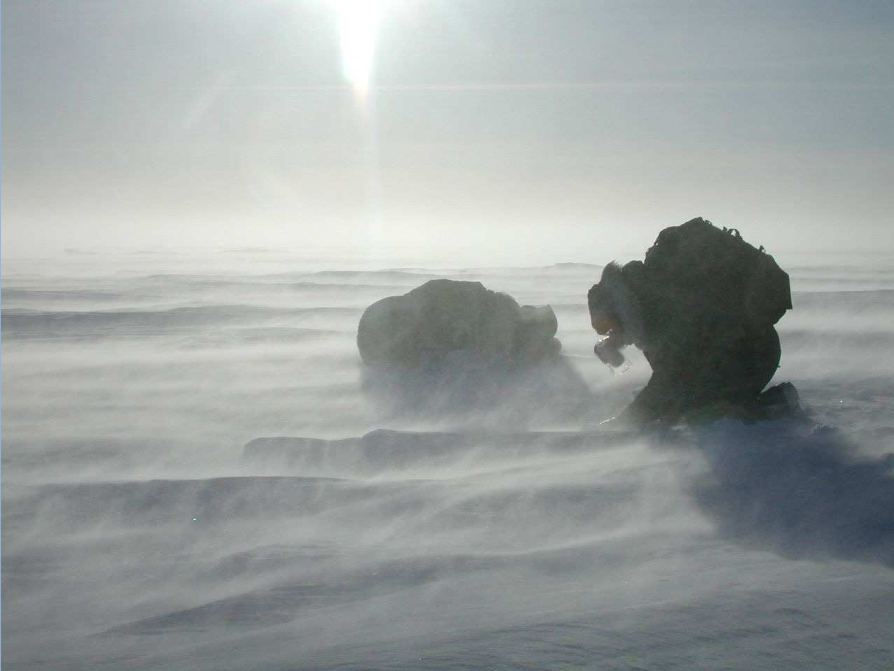
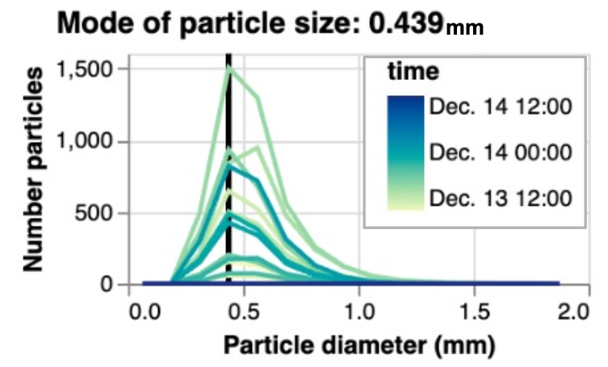

# 6) Blowing snow transport and sublimation

I highly recommend watching Dr. Matthew Sturm's Lecture on blowing snow, snow dunes, and other snow landforms. 

This link to his [lecture on blowing snow](https://youtu.be/rBlDG9Tp8rM?si=dqCCF-sW0NXQYG5i&t=3658) begins at the part talking about snow dunes/landforms, but the entire lecture (from the beginning) is worth your time.



For our homework, we will try to do something not covered closely in the video - estimating the sublimation rate of blowing snow.

In the homework assignment below, we will find that blowing snow sublimation is an important contributor to total sublimation at the Kettle Ponds site in Colorado. While blowing snow in alpine environments is a rather niche topic, note that blowing snow sublimation is a primary mass ablation process in polar regions, influencing sea level rise as well as the global energy surface energy balance (see [Sharma et al. 2018](https://tc.copernicus.org/articles/12/3499/2018/) and [Sigmund et al. 2022](https://link.springer.com/10.1007/s10546-021-00653-x)).

At the Kettle Ponds field site, we will estimate the rate with two simple methods,  which provide opportunity for future improvement.

## Flux Divergence Model - Estimating blowing snow sublimation with EC measurements

In the atmospheric boundary layer, the conservation of water equation often simplifies to 

$$S = \frac{\partial \overline{w'\rho_v'}}{\partial z}$$

where $S$ is a source term (grams of water vapor per m^3 of air), representing addition of water vapor to the atmosphere by blowing snow sublimation, and the derivative term represents the change in the vertical turbulent flux of water vapor with height above the snow surface.

When the derivative term is positive, a higher EC (e.g. 10m) may measure larger w'ρᵥ' than a lower EC (e.g. 3m). This was observed at Kettle Ponds during a blowing snow event on 21--22 December 2022 (Lundquist et al., 2024, DOI 10.1175/BAMS-D-23-0191.1).

Using a finite different approximation to the derivative above, one could try a very rough estimation of the blowing snow sublimation rate.

$$
S = \frac{\partial \overline{w'\rho_v'}}{\partial z} 
\approx \frac{\Delta \overline{w'\rho_v'}}{\Delta z} 
 \quad \Bigg[ \frac{\text{g/m}^2\text{/2}}{\text{m}} \Bigg] \Rightarrow \Bigg[ 
    \frac{\text{g}}{\text{m}^3} 
\Bigg]
$$

and so, in our case, using measurements at 10 and 1 meters, we will approximate $S$

$$
S \approx \frac{
    \overline{w'\rho_v'}_{z=10m} - \overline{w'\rho_v'}_{z=1m}
}{\
     10 - 1 \text{m}
}
$$

Note that if we want to compare this estimation of the blowing snow sublimation rate (in g/m^3, a flux density) to the surface sublimation rate, we can multiply by the height of the blowing snow layer that we are estimating, in this case 9m, which gives us the blowing snow sublimation rate in the units of a flux (g/m^3/s)

$$
S_{\text{flux}} \approx \overline{w'\rho_v'}_{z=10m} - \overline{w'\rho_v'}_{z=1m}.
$$

## Particle Model - Estimating blowing snow sublimation with FlowCapt and Meteorological measurements - AKA the Spherical Cow Model

We can also estimate blowing snow sublimation using a particle model, where we consider the physics of sublimation for $n$ particles in the airspace at Kettle Ponds. 
For this model, we will keep things as simple as possible, but real blowing snow models
(e.g. [Déry and Yau 1999](http://link.springer.com/10.1023/A:1002065615856), [Bintanja 2000](http://link.springer.com/10.1023/A:1002676804487)) are based on the same equations or similar equations.

We can conceptualize a blowing snow model by considering some simple facts about the airspace above a snow surface. The total blowing snow sublimation (subl.) is equal to the average sublimation rate of a single snowflake, multiplied by the number of snowflakes in the airspace:

$$ 
\text{BS Subl. Rate} \Bigg[ \frac{\text{g}}{\text{m}^3 s}\Bigg]
 = 
\text{Single Snowflake Subl. Rate} \Bigg[ \frac{\text{g}}{s}\Bigg]
\cdot \text{Particle Density} \Bigg[ \frac{\text{n particles}}{\text{m}^3}\Bigg]
$$

We can use the SOS measurements at Kettle Ponds to estimate both terms on the right side of the equation.

### Estimating snowflake particle density

> Milk production at a dairy farm was low, so the farmer wrote to the local university, asking for help from academia. A multidisciplinary team of professors was assembled, headed by a theoretical physicist, and two weeks of intensive on-site investigation took place. The scholars then returned to the university, notebooks crammed with data, where the task of writing the report was left to the team leader. Shortly thereafter the physicist returned to the farm, saying to the farmer, "I have the solution, but it works only in the case of spherical cows in a vacuum." 
> 
> 
> 
> [Credit to Wikipedia](wikipedia.org/wiki/Spherical_cow)

To calculate particle density, we assume that all blowing snow particles are traveling with the measured wind speed (U), and that all snowflakes have the same shape (spherical) and mass. With these assumptions, we can convert blowing snow flux (BS Flux) measured by the FlowCapt sensor into a blowing snow mass concentration (BS Mass Conc.),
$$
\text{BS Mass Conc.} \Bigg[ \frac{\text{g}}{\text{m}^3}\Bigg]
= \text{BS Flux} \Bigg[ \frac{\text{g}}{\text{m}^2 s}\Bigg] 
\div U \Bigg[ \frac{\text{m}}{\text{s}}\Bigg].
$$
With the BS mass concentration, we can estimate the snowflake particle concentration, by dividing by the average snowflake mass. Assuming all snowflakes are spherical, 
$$
\text{Snowflake Mass} \Bigg[\text{g}\Bigg] = \text{Volume}_{snowflake} * \rho_{ice} = \frac{4}{3}\pi r^3 \rho_{ice}
$$
where r is the radius of the spherical snowflake particles. Now we have

$$
\text{Particle Density} \Bigg[ \frac{\text{n particles}}{\text{m}^3}\Bigg]
= \text{BS Mass Conc.} \Bigg[ \frac{\text{g}}{\text{m}^3}\Bigg]
\div \text{Snowflake Mass} \Bigg[\text{g}\Bigg]
$$

### Estimating snowflake sublimation (by assuming snowflakes are spherical ice particles)

To estimate snowflake sublimation rates, we use the classic [Thorpe and Mason  (1966)](https://iopscience.iop.org/article/10.1088/0508-3443/17/4/316) model. This model measures the rate of mass change due to sublimation (g/s) using the equation 

$$
\text{Single Snowflake Subl. Rate} \Bigg[ \frac{\text{g}}{s}\Bigg] =\frac{d m}{d t} = \dfrac{
    2 \pi r ( q / q_s - 1)
}{
    \dfrac{L_s}{K T} \dfrac{1}{Nu} \Big( \dfrac{L_s M}{R T} - 1\Big) + \dfrac{1}{D q_s Sh}
}
$$

where
$r$ is the sphere radius,
$q$ is absolute humidity in the environment,
$q_s$ is the absolute humidity at the ice sphere surface, when is assumed to be at saturation, and is therefore a function of temperature,
$L_s$ is the latent heat of sublimation,
$K$ is the themal conductivity of air,
$T$ is the temperature in the environment (in Kelvin),
$M$ is the molecular weight of water,
$R$ is the universal gas constant,
$D$ is the coefficient of molecular diffusion of water vapor in air,
$Nu$ is the Nusselt number and
$Sh$ is the Sherwood number, both of which describe the rate of mass and heat transfer due to ventilation of the ice sphere by air. This equation is the basis of most blowing snow models, although recent work has re-examined the assumptions underlying this equation. In particular, [Sharma et al. (2018)](https://tc.copernicus.org/articles/12/3499/2018/) examined applicability of the Thorpe-Mason model.

### Combining the above
With the information above, we can now calculate the BS sublimation rate (See the first equation in the section *Estimating blowing snow sublimation with a simple particle model*).

Note that, similar to the flux divergence model presented earlier, we can convert blowing snow sublimation rate in units of (g/m^3/s) to a blowing snow sublimation flux in units of (g/m^2/s) by multiplying by the depth over which we account for blowing snow sublimation. Because we only have blowing snow flux measurements (and therefore particle density estimate) up to 2 meters, you can either calculate this flux over the lowest 1 or 2 meters of the atmosphere, depending on if you incorporate blowing snow flux measurements from both FlowCapt sensors or from just the lower FlowCapt sensor. 

$$
S_{particle, flux} \Bigg[ \frac{\text{g}}{\text{m}^2 s}\Bigg] = H \Bigg[ \text{m} \Bigg] \cdot \text{BS Subl. Rate} \Bigg[ \frac{\text{g}}{\text{m}^3 s}\Bigg]
$$
where H is one or two meters. 


Note that the 1m and 2m FlowCapt sensors measure blowing snow fluxes between 0--1 and 1--2 m above ground level, respectively. 

For the homework assignment, you will estimate blowing snow sublimation rates using the two methods described above. Below, I've provided some code to get you started on using the Thorpe-Mason equation.

```
def particle_sublimation_rate(T, q_s, q, r, lambda_s, k_T, Nu, M_w, R_g, k_v, Sh):
    """ Estimate particle sublimaton rate (g/s) using the Thorpe-Mason model.
        See Thorpe and Mason, 1966, their Equation 10 (the first form, on the left side)
        T - ambient air temperature (K)
        q_s - saturation absolute humidity (g/m^3)
        q - ambient air absolute humidity (g/m^3)
        r - ice particle radius (m)
        lambda_s - latent heat of sublimation (J/kg)
        k_T - thermal conductivity for air (W/m/K)
        Nu - Nusselt number, typical values for snowdrifts are 2--10 (dimensionless)
        M_w - molecular weight of water vapour
        R_g - universal gas constant (J/mol/K)
        k_v - molecular diffusivity of h2o vapour in air (m2 s−1)
        Sh - Sherwood number, typical values for snowdrifts are 2--10 (dimensionless)
    """
    dm_dt = (
        2*np.pi*r* (q/q_s - 1)
    ) / (
        (lambda_s/(k_T * T)) * (1 / Nu) * (lambda_s * M_w / (R_g * T)) + 1/(k_v * q_s * Sh)
    ).to_base_units()
    return dm_dt
```

And here are constants for the equation above that you should use. 
```
from metpy.units import units
lambda_s = 2838000*units("J/kg")# latent heat of sublimation (J kg−1)
k_T = 0.02288*units("W/m/K")    # thermal conductivity air, for air at -10˚C  (W/m/K)
Nu = 8                          # Nusselt number, typical values for snowdrifts: 2 - 10
M_w = 0.018*units("kg/mol")     # molecular weight of water vapour (kg/mol)
R_g = 8.3145*units("J/mol/K")   # universal gas constant (J mol−1 K−1)
k_v = 24.9*1e-6*units("m^2/s")  # molecular diffusivity of h2o vapour in air (m2 s−1)
Sh = Nu   
```

This leaves you to gather 
$T$, 
$q_s$,
$q$, and
$r$
.
These variables are time series and should change at each timestep you calculate snowflake sublimation. 
You can and should treat r as a constant, for simplicity.

## Labs
```Note
Note that these labs use quite a few files. For lab6-3, you must download files from the links included in the notebook.
* [Lab 6-1](lab6/lab6-1.ipynb) - Examining blowing snow thresholds with SOS tower measurements.
* [Lab 6-2](lab6/lab6-2.ipynb)
* [Lab 6-3](lab6/lab6-3.ipynb)
* [SoS dataset](data/sos_full_dataset_30min.nc) - Data collected by the Sublimation of Snow Campaign at Kettle Ponds
* [30-minute precipitation dataset](data/kettle_ponds_precip_30min.csv) - Data collected by the SAIL campaign at Kettle Ponds
* [Elevation dataset](data/east_river_elevation.tif)
* [Elevation hillshade dataset](data/east_river_hillshade.tif)
* [Elevation hillshade dataset](data/eastriver_snowdepth_2023april01.tif)
* [East river polygon](data/east_polygon.json)
* [Elevation transects](data/transects.geojson)
```

## Homework 6
For this assignment, you will implement the two blowing snow sublimation models described above (the "flux-divergence" model and the "particle" model) for two blowing snow events, 12--14 December 2022 and 21-22 December 2022. 

1. For both case studies, plot time series of blowing snow flux from both FlowCapt sensors and w'ρᵥ' at 1 and 10 meters. (Variables in the SOS dataset are `SF_avg_1m_ue`, `SF_avg_2m_ue`, `w_h2o__1m_c`, `w_h2o__10m_c`). Explain how blowing snow and turbulent water vapor fluxes vary with height during the two case studies, and why.
2. Using the flux divergence model, calculate time series of S<sub>flux</sub> for the length of the two events. Using the particle model, calculate time series of S<sub>particle, flux</sub> for the length of the two events. Use the constants I provide above for the particle model. Choose your own value for snowflake/ice particle radius (r). For the two events, create a time series plot that includes lines for w'ρᵥ' at 1 meter, w'ρᵥ' at 10 meters, S<sub>flux</sub>, and S<sub>particle, flux</sub>. 

> Note that estimates of S<sub>particle, flux</sub> are very sensitive to snowflake/ice particle radius (r). 
> For this assignment, I want you use to use r as a fitting parameter - i.e., modify values of r until your estimates of S<sub>particle, flux</sub> are within a reasonable range of w'ρᵥ' measurements.
> The image below shows the measured distribution of blowing snow particle sizes throughout the early December blowing snow event. I found that for the particle model to produce reasonable results, a very small snowflake size is necessary. Try values between 10<sup>-5</sup> to 10<sup>-3</sup>.
> 

3. With respect to your plots from Question 2, answer the following questions. What do the two model results tell you about blowing snow sublimation during the events? Which of the two models seems to produce more reasonable results? Which model do you believe more?

4. Describe the shortcomings of the flux divergence model, as implemented here.

5. Describe the shortcomings of the particle model, as implemented here. Include in your answer: your final choice for particle radius and how that compares to measurements of particle radii in the figure above.