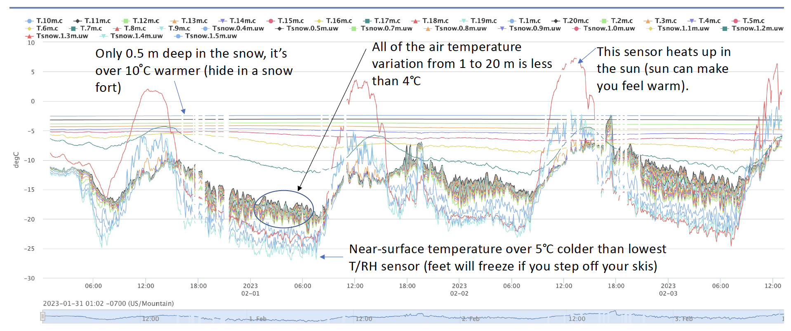

# 6) Temperatures above, below, and within the snow

Data visualization (Note, the files below were developed by Steven Pestana for working with air temperature data but may be helpful with visualizing our snow data):
- [Interactive Plots](lab5/interactive-plots.ipynb) with [iButtons_2008-2010.mat](data/iButtons_2008-2010.mat)
- [Warming Stripes Figure](lab5/warming-stripes.ipynb)

# Background


### Temperatures in and on the snow
* To see Danny explain the snow temperature deployment, click [here](https://www.youtube.com/watch?v=OGa2GtRcdIw)
* [Click here to listen to Matthew Sturm explain heat conduction in snow](https://www.youtube.com/watch?v=tg2v1DC5Nrk&list=PLPG5Ed5L1SY4RpFe-55WAlFZ58-TwwrWw&index=5) 
* Note, you want to start at minute 2:00 and go to minute 41.  Matthew spent 15 years studying snow conductivity, and he explains the basics of fluxes, gradients, and conduction, as well as details of the current knowns and unknowns. 

### Temperatures over the snow
* [Jessica explains why people are installing temperature and humidity sensors on a tower](https://www.youtube.com/watch?v=siLiBWeExQ8) 

### Air temperatures in the mountains
* For an overview of mountain temperatures and lapse rates, check out Jessica's seminar on [How cold is it in the mountains](https://youtu.be/saUe3uIegRs) 


```note
## Lab 6: Plotting temperatures in and around the snow.

Download the lab and data files to your computer. Then, upload them to your JupyterHub [following the instructions here](/resources/b-learning-jupyter.html#working-with-files-on-our-jupyterhub).

* [Lab 6-1: Temperatures in and below the snow and the heat equation](lab6/lab6-1.ipynb)
* [Lab 6-2: Snow surface temperatures derived from radiation](lab6/lab6-2.ipynb)
* [Lab 6-3: Air temperature and atmospheric stability](lab6/lab6-3.ipynb)
* [BONUS Lab 6-4: Sounding data from SAIL at Gothic, CO](lab6/lab6-4.ipynb)
* [26 Dec 2021 Sounding data for lab 6-4](data/2021-12-26_radiosonde.csv)
* [03 Jan 2022 Sounding data for lab 6-4](data/2022-01-03_radiosonde.csv)
* [06 Jan 2022 Sounding data for lab 6-4](data/2022-01-06_radiosonde.csv)
* [10 Jan 2022 Sounding data for lab 6-4](data/2022-01-10_radiosonde.csv)

```

## Homework 6

### Problem 1: Measuring snow temperatures and deciding how to trust the measurements  
Using the data presented in labs, pick three different 3-day-durationperiods in each of early season (Nov-Dec), mid season (Jan-Feb) and late season (April). Plot the temperatures.  Determine which of the "snow temperature" sensors are actually in the snow at each side.  Also determine which sensors are "broken" and displaying nonsensicle results.  Explain your answers.   

 
 ```tip
Learning to manipulate all of this data in python is hard.  Please post on slack if anything is causing you trouble -- your fellow students can help you!
```

### Problem 2:  Calculating atmospheric stability
[Static stability](https://glossary.ametsoc.org/wiki/Static_stability) is related to the change in temperature with height.  If you choose to use the sounding data, you must be sure to use [potential temperature](https://en.wikipedia.org/wiki/Potential_temperature).  For this problem, just focus on our data from the surface to 20 m, and it's okay to just use temperature within that narrow elevation range. The change in temperature with height above the surface is a measure of the stability.  Pick out three different days in our dataset and calculate dT/dz over the first 2 meters and over the first 20 meters. Make plots of temperature vs elevation.  Is the change in temperature with height linear?  Does that depend on the day?  What do you think controls the change in temperature with height over the snow?  Feel free to plot some other variables from earlier labs to test your hypotheses. 

Lab 6-4 includes more of atmospheric stability over a greater range of heights using the sounding data from SAIL.

### BONUS Problem: Working with the heat equation
We have talked in class about snow being insulating and about the surface skin temperature of the snow changing rapidly in time.  But how is energy at the surface translated into the lower layers?  We can estimate the thermal conductivity of our snowpack using the one-dimensional heat equation. 

The one-dimensional heat equation is given by:


where  is the temperature at position z and time t, and  is the thermal diffusivity of the material.

Using the material provided in Lab 6-1, pick a period of about 5-7 days wherein (a) you trust the temperature measurements and (b) that have a clear diurnal cycle in the surface temperature.  Assign that rapidly varying surface temperature as one boundary condition and provide the lowest temperature (you can presume it's constant0 as the other boundary condition.  Then, numerically integrate the heat equation to determine the time-varying temperatures at the snow layers in between.  Comparing your simulation with the observations, what is your best guess of the thermal conductivity of the snowpack?  Hint, you may want to rerun your simulation, iterating over multiple values of thermal conductivity.  


