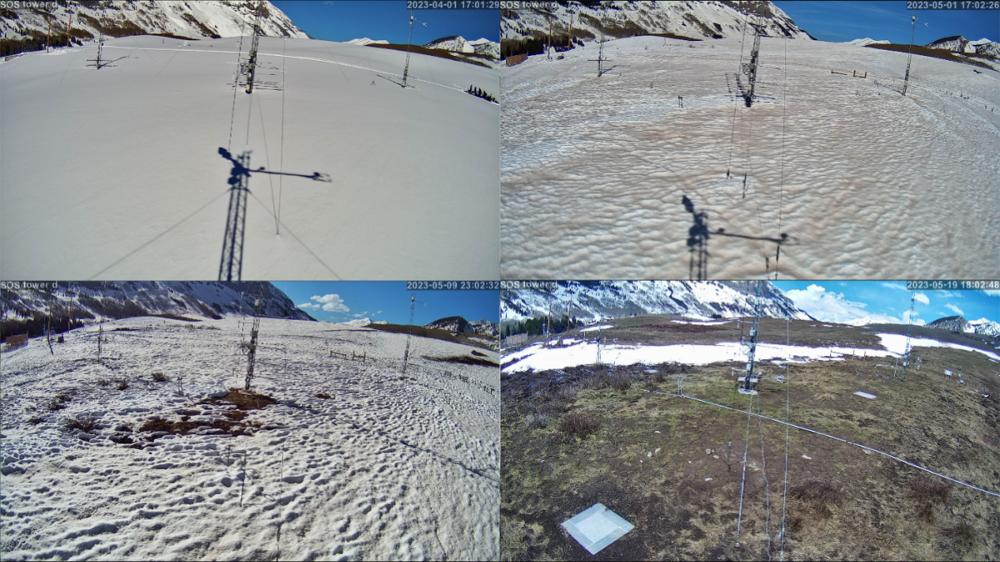

# 7) Snow melt



## Background

All good things, like the seasonal snowpack, must end. The 2022-2023 snowpack at Kettle Ponds, though eternal in our minds, did indeed melt away. In this module, we examine Kettle Ponds field measurements, as well as some Snotel measurements.
We examine the snowpack ripening process using in-snow thermistors and measurements of various components of the energy balance. 
We also examine the initiation of melt and percolation of melt water using snow surface temperatures and soil moisture sensors.
Finally, we test a "Temperature-Index" method for estimating snowmelt rates from air temperature. 

Melting season is accompanied by wet snow metamorphism (which we covered in an earlier lecture). If you want to learn more about wet snow metamorphism, check out [Matthew Sturm's lecture on the matter](https://youtu.be/tg2v1DC5Nrk?si=w28f1lgThRipCR7H&t=3096).
Make sure to check out slush flows and wet snow mysteries at 1 hour 20 minutes and 20 seconds.


## Temperature-Index method

This basic model for snowmelt is based on the idea that changes in air temperature provide an index of snowmelt. This has some basics in physics, because tmeperature provides a _loose_, integrated measure of the sensible energy available for snowmelt.
This method is particularly useful because air temperature is probably the most widely measured meteorological variable. 
The approach uses the following equation

$$ M = M_f (T_a - T_0) $$

where M is snowmelt rate (mm/day),
T<sub>a</sub> is the daytime mean or daytime maximum air temperature (˚C),
T<sub>0</sub>  is a reference temperature (˚C) above which snowmelt occurs, generally set to 0˚C, and
M<sub>f</sub> is calleed the "degree day factor" (mm/˚C/day), and is a fitted parameter that describes the relationship between air temperature and melt rates.

In Lab 7-3, we use this method and test its performance in the East River Valley. For our purposes, we will consider "daytime" to be between 0900-1700, and we will set T<sub>0</sub>=0˚C.

## Labs
```note
* [Lab 7-1](lab7/lab7-1.ipynb) - Observations of snowpack ripening and melt initiation
* [Lab 7-2](lab7/lab7-2.ipynb) - Observations of the snowpack energy balance during ripening
* [Lab 7-3](lab7/lab7-3.ipynb) - Predicting snowmelt rates with the Temperature-Index method
* [SoS dataset](data/sos_full_dataset_30min.nc)
* [Precipitation dataset](data/kettle_ponds_precip.csv)
```

## Homework 7
On Tuesday February 25th, we will hold a discussion on one of the papers listed below. 
Please review the abstracts of the two papers and decide which paper you prefer to read - we will collectively decide on a paper in class on Thursday February 20th.

(Painter et al., 2012, Dust radiative forcing in snow of the Upper Colorado River Basin:  1. A 6 year record of energy balance, radiation, and dust concentrations)[https://agupubs.
onlinelibrary.wiley.com/doi/10.1029/2012WR011985]

(Brandt et al., 2022, A Review of the Hydrologic Response Mechanisms During Mountain Rain-on-Snow)[https://www.frontiersin.org/articles/10.3389/feart.2022.791760/full]

The homework assignments for modules 7 and 8 are lumped together. See Module 8 for your homework assignment, Due March 6th.